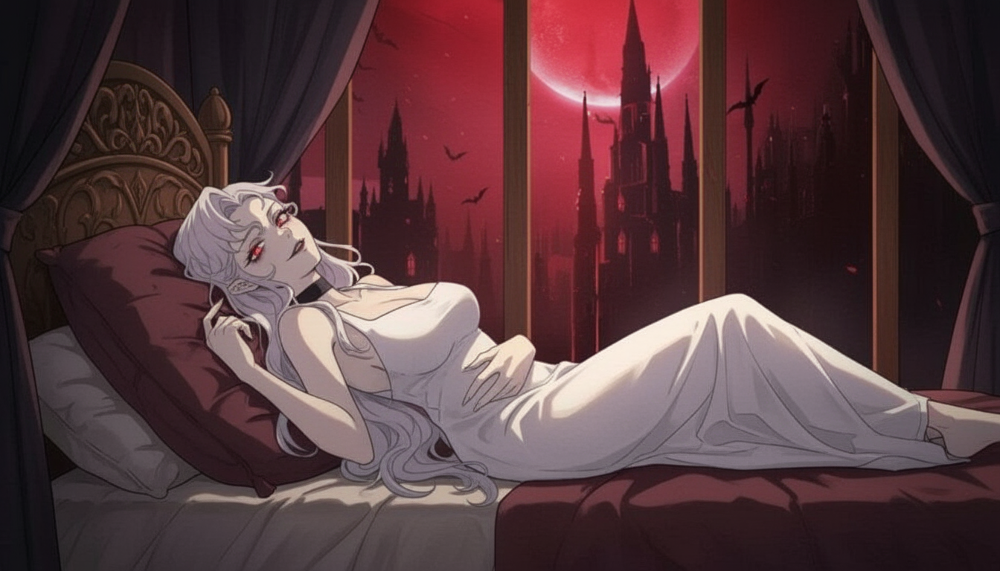
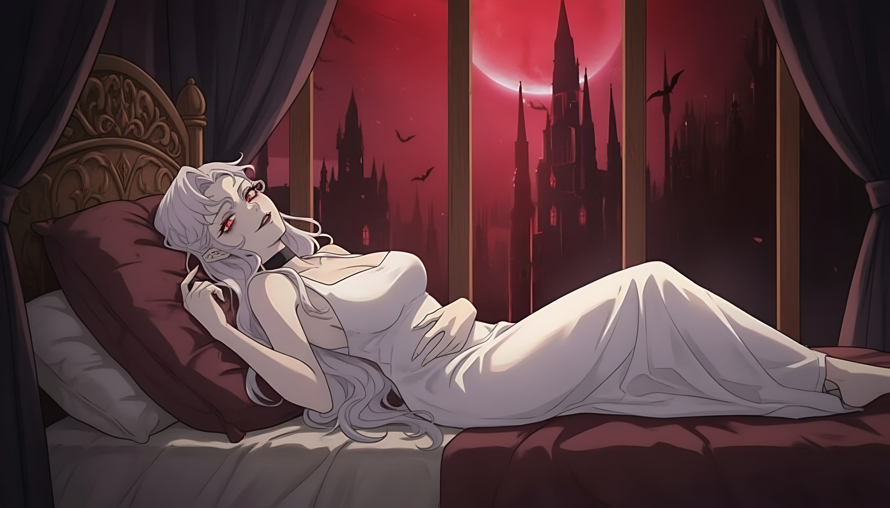

<div align="center">

# 🚀 ZettaUpscaler

### AI 기반 이미지 & 비디오 업스케일링 도구

[](https://www.python.org/)
[](https://developer.nvidia.com/cuda-toolkit)
[](LICENSE)
[](https://github.com/xinntao/Real-ESRGAN)

<p align="center">
  <strong>AI로 미디어 품질 향상 • 4배 해상도 • GPU 가속 • 아름다운 CLI</strong>
</p>

[🚀 빠른 시작](#-빠른-시작) • [📖 설치](#-설치) • [🔄 업데이트](#-업데이트) • [💡 사용법](#-사용법) • [🛠️ 문제 해결](#️-문제-해결)

</div>

---

## ✨ 주요 기능

<table>
<tr>
<td width="50%">

### 🎨 **AI 업스케일링**
- Real-ESRGAN 모델로 뛰어난 품질
- 최대 4배 해상도 향상
- 콘텐츠별 다양한 모델 제공

### 🎮 **GPU 가속**
- NVIDIA GPU 자동 감지
- FP16 최적화로 빠른 처리
- CPU 자동 폴백 지원

</td>
<td width="50%">

### 📹 **완벽한 미디어 지원**
- 오디오 보존하며 비디오 처리
- 여러 파일 일괄 처리
- 모든 주요 포맷 지원

### 💻 **아름다운 인터페이스**
- Rich 터미널 UI와 프로그레스바
- 실시간 처리 통계
- Windows Terminal 통합

</td>
</tr>
</table>

## 📊 성능

| 하드웨어 | 이미지 (1080p→4K) | 비디오 (1분 1080p→4K) |
|----------|------------------|------------------------|
| RTX 4090 | ~1초 | ~2-3분 |
| RTX 4060 Ti | ~1.5-2초 | ~3-5분 |
| RTX 3070 | ~2-3초 | ~5-7분 |
| CPU (i9) | ~30-60초 | ~30-60분 |

---

## 📖 설치

### 🆕 처음 설치하는 경우

<details>
<summary><b>Windows (권장)</b></summary>

1. **저장소 클론**
   ```bash
   git clone https://github.com/darkdarkcocoa/ZettaUpscaler.git
   cd ZettaUpscaler
   ```

2. **설치 프로그램 실행** (마우스 우클릭 → 관리자 권한으로 실행)
   ```bash
   install.bat
   ```
   
   자동으로 설치되는 항목:
   - ✅ Python 3.12 (필요시)
   - ✅ FFmpeg (비디오 처리용)
   - ✅ 가상환경 생성
   - ✅ 모든 의존성 패키지
   - ✅ AI 모델 다운로드

3. **설치 확인**
   ```bash
   upscale doctor
   ```

</details>

<details>
<summary><b>Linux / macOS</b></summary>

1. **사전 요구사항**
   ```bash
   # Ubuntu/Debian
   sudo apt update
   sudo apt install python3.10+ python3-pip ffmpeg git
   
   # macOS
   brew install python@3.10 ffmpeg git
   ```

2. **클론 및 설정**
   ```bash
   git clone https://github.com/darkdarkcocoa/ZettaUpscaler.git
   cd ZettaUpscaler
   
   # 가상환경 생성
   python3 -m venv .venv
   source .venv/bin/activate  # Windows: .venv\Scripts\activate
   
   # 의존성 설치
   pip install -r requirements.txt
   ```

3. **도구 실행**
   ```bash
   python -m upscaler --help
   ```

</details>

### 🔄 업데이트

<details>
<summary><b>⚠️ 기존 사용자 필독! - 중요!</b></summary>

업데이트를 받은 후 (`git pull`), **반드시** 의존성을 업데이트해야 합니다:

```bash
# Windows - 간편 방법
update.bat

# Windows - 수동 방법
cd ZettaUpscaler
git pull
.venv\Scripts\pip install -r requirements.txt --upgrade

# Linux/macOS  
cd ZettaUpscaler
git pull
source .venv/bin/activate
pip install -r requirements.txt --upgrade
```

**왜 필요한가요?**
- 새 기능이 추가 라이브러리를 요구할 수 있음 (예: `rich` - 아름다운 UI)
- 버그 수정을 위해 패키지 버전이 업데이트됨
- 모델 설정이 변경되었을 수 있음

**Windows 사용자용 간편 업데이트:**
```bash
# update.bat 실행하면 자동으로:
# 1. git pull (최신 코드 받기)
# 2. pip 업데이트 (의존성 설치)
# 3. 설치 검증 (doctor 실행)
```

</details>

---

## 💡 사용법

### 기본 명령어

#### 🖼️ **이미지 업스케일링**
```bash
# 간단한 4배 업스케일링
upscale image input.jpg output.jpg

# 특정 모델 사용
upscale image photo.jpg photo_hd.jpg --model realesrgan-x4plus

# 2배 업스케일링 (더 빠름)
upscale image input.png output.png --scale 2
```

#### 🎬 **비디오 업스케일링**
```bash
# 기본 비디오 업스케일링
upscale video input.mp4 output.mp4

# 오디오 보존 (기본값)
upscale video vacation.mp4 vacation_4k.mp4 --copy-audio
```

#### 📁 **일괄 처리** (신기능!)
```bash
# 현재 폴더의 모든 미디어 처리
upscale all

# 비디오만 처리
upscale all --type video

# 특정 패턴의 이미지만
upscale all --type image --pattern "*.jpg"

# 하위 폴더 포함 + 출력 폴더 지정
upscale all --recursive --output D:\Upscaled

# 실제 처리 없이 미리보기
upscale all --dry-run
```

### 고급 옵션

| 옵션 | 설명 | 예시 |
|--------|-------------|---------|
| `--scale` | 업스케일 배율 (2 또는 4) | `--scale 2` |
| `--model` | AI 모델 선택 | `--model realesrgan-x4plus-anime` |
| `--tile` | 타일 크기 (VRAM 부족시) | `--tile 256` |
| `--fp16` | 반정밀도 사용 (더 빠름) | `--fp16` |
| `--face-enhance` | GFPGAN으로 얼굴 향상 | `--face-enhance` |

### 사용 가능한 모델

| 모델 | 최적 용도 | 명령어 |
|-------|----------|---------|
| `realesr-general-x4v3` | 일반 콘텐츠 (기본값) | 기본값 |
| `realesrgan-x4plus` | 사진 및 실사 이미지 | `--model realesrgan-x4plus` |
| `realesrgan-x4plus-anime` | 애니메이션 및 일러스트 | `--model realesrgan-x4plus-anime` |

---

## 🎯 활용 예시

### 전후 비교

<table>
<tr>
<td align="center">
<b>원본</b><br>

</td>
<td align="center">
<b>업스케일 (4x)</b><br>

</td>
</tr>
</table>

### 일반적인 사용 사례

```bash
# 오래된 가족 사진 복원
upscale image "family_1990.jpg" "family_1990_restored.jpg" --model realesrgan-x4plus --face-enhance

# 애니메이션 배경화면 업스케일
upscale image anime.png anime_4k.png --model realesrgan-x4plus-anime

# 제주도 여행 비디오 처리
upscale video "Jeju_2023.mp4" "Jeju_2023_4K.mp4" --scale 4

# 게임 스크린샷 일괄 처리
upscale all --pattern "Screenshot*.png" --output ./enhanced
```

---

## 🛠️ 문제 해결

<details>
<summary><b>CUDA/GPU가 인식되지 않음</b></summary>

```bash
# GPU 상태 확인
upscale doctor

# 필요시 CPU 모드 강제
upscale image input.jpg output.jpg --device cpu
```

다음 사항을 확인하세요:
- CUDA 지원 NVIDIA GPU 보유
- 최신 NVIDIA 드라이버 설치
- CUDA Toolkit 11.8+ (선택사항이지만 권장)
</details>

<details>
<summary><b>메모리 부족 (OOM) 오류</b></summary>

```bash
# 타일 크기 줄이기
upscale image input.jpg output.jpg --tile 256

# 4배 대신 2배 사용
upscale image input.jpg output.jpg --scale 2

# FP16 비활성화 (메모리 더 사용하지만 안정적)
upscale image input.jpg output.jpg --no-fp16
```
</details>

<details>
<summary><b>업데이트 후 모듈을 찾을 수 없음</b></summary>

```bash
# 모든 의존성 재설치
pip install -r requirements.txt --upgrade --force-reinstall

# 또는 가상환경 완전 재생성
rmdir /s /q .venv  # Windows
rm -rf .venv       # Linux/macOS
python -m venv .venv
.venv\Scripts\activate  # Windows
source .venv/bin/activate  # Linux/macOS
pip install -r requirements.txt
```
</details>

<details>
<summary><b>basicsr import 오류 (torchvision 호환성)</b></summary>

**오류 메시지:**
```
ModuleNotFoundError: No module named 'torchvision.transforms.functional_tensor'
```

**해결 방법:**
```bash
# basicsr 호환성 패치 실행
python patch_basicsr.py

# 또는 가상환경 안에서
.venv\Scripts\python patch_basicsr.py  # Windows
source .venv/bin/activate && python patch_basicsr.py  # Linux/macOS
```

**문제 원인:**
- basicsr이 구 버전 torchvision API (`functional_tensor`) 사용
- torchvision 0.15+ 버전에서 해당 모듈이 `functional`로 통합됨
- `patch_basicsr.py`가 자동으로 import 경로를 수정해줌

</details>

<details>
<summary><b>처리 후 비디오에 오디오가 없음</b></summary>

```bash
# --copy-audio가 활성화되어 있는지 확인 (기본값임)
upscale video input.mp4 output.mp4 --copy-audio

# 입력 파일에 오디오가 있는지 확인
ffmpeg -i input.mp4 2>&1 | grep Audio
```
</details>

---

## 📚 문서

- 📖 [전체 문서](docs/README.md)
- 🔧 [API 레퍼런스](docs/API.md)
- 🎓 [모델 학습 가이드](docs/TRAINING.md)
- 💻 [개발 가이드](docs/DEVELOPMENT.md)

## 🤝 기여하기

기여를 환영합니다! 먼저 [기여 가이드라인](CONTRIBUTING.md)을 읽어주세요.

```bash
# 저장소 포크 후:
git clone https://github.com/darkdarkcocoa/ZettaUpscaler.git
cd ZettaUpscaler
git checkout -b feature/your-feature
# 변경사항 작성
git commit -m "추가: 새 기능"
git push origin feature/your-feature
# Pull Request 생성
```

## 📄 라이선스

이 프로젝트는 MIT 라이선스 하에 있습니다 - [LICENSE](LICENSE) 파일을 참조하세요.

## 🙏 감사의 말

- [Real-ESRGAN](https://github.com/xinntao/Real-ESRGAN) by xinntao
- [GFPGAN](https://github.com/TencentARC/GFPGAN) - 얼굴 향상
- [Rich](https://github.com/Textualize/rich) - 아름다운 터미널 UI
- 이 프로젝트의 모든 기여자와 사용자

---

<div align="center">

**⭐ 유용하다면 Star를 눌러주세요!**

[버그 신고](https://github.com/darkdarkcocoa/ZettaUpscaler/issues) • [기능 요청](https://github.com/darkdarkcocoa/ZettaUpscaler/issues)

Made with ❤️ by ZETTA MEDIA

<!-- Last updated: 2025-01-15 -->

</div>